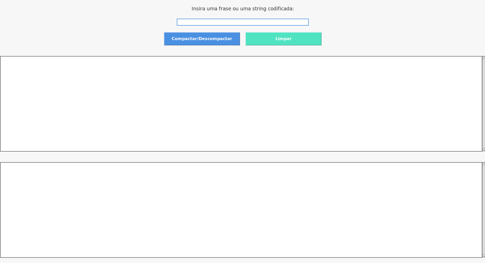
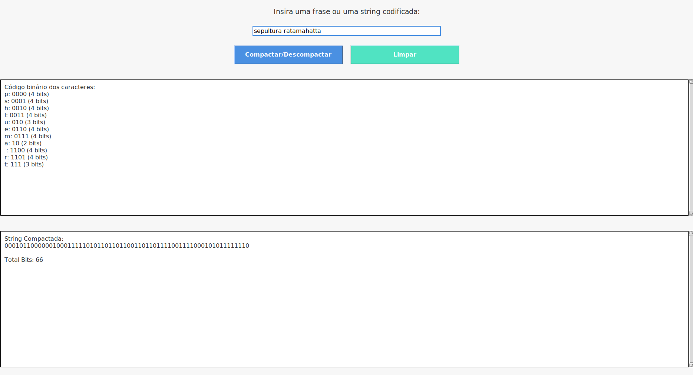
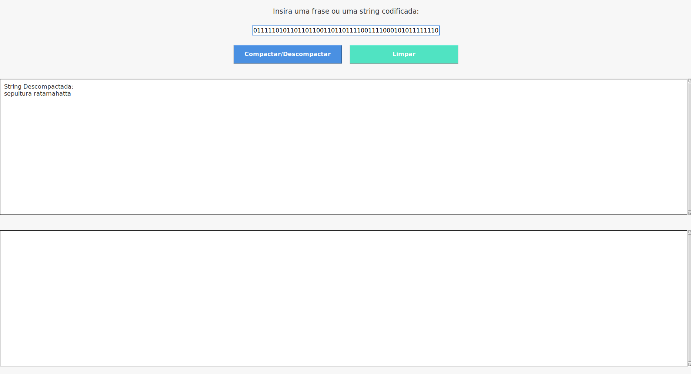

# Greed - Compactar e Validar

**Número da Lista**: 4 
**Conteúdo da Disciplina**: Greed 

## Alunos

| Matrícula | Aluno                                |
| --------- | ------------------------------------ |
| 211031771 | Lucas Lopes Frazão                   |
| 211031459 | Pedro Henrique Rodrigues de Carvalho |

## Sobre 

O objetivo do nosso projeto é implementar a compactação de strings e a validação da string compactada, utilizando o Algoritmo de Huffman. Através desse algoritmo, buscamos reduzir a quantidade de bits necessária para representar uma string, otimizando o armazenamento. O projeto é desenvolvido em Python e aplica o conceito aprendido em sala de aula, oferecendo uma solução eficiente para a compressão de dados. Além disso, o sistema valida a integridade da string compactada, garantindo que a operação de compressão e descompressão ocorra corretamente.

## Screenshots

## Vídeo

[Acesse o vídeo](https://youtu.be/x1UZCURrCNI)

## Instalação 
**Linguagem**: Python 
**Sistema Operacional**: Linux 

## Passo a passo

1. Verificar se o Tkinter já está instalado 
Antes de prosseguir com a instalação, é importante verificar se o módulo tkinter já está disponível no Python instalado no sistema. Para isso, execute o seguinte comando no terminal: 
`
python3 -m tkinter
` 
Se nenhuma janela abrir ou ocorrer um erro, significa que o Tkinter não está instalado.

2. Instalar o Tkinter 
Caso o Tkinter não esteja disponível, você pode instalá-lo com o seguinte comando: 
`
sudo apt-get install python3-tk
` 

3. Confirmar a Instalação 
Após a instalação, verifique novamente se o Tkinter foi configurado corretamente: 
`
python3 -m tkinter
` 
Uma janela deve abrir, confirmando que o Tkinter está funcionando.

4. Executar o Programa 
Navegue até o diretório onde o arquivo main.py está localizado e execute o seguinte comando para iniciar o programa: 
`
python3 main.py
` 

## Instalação
**Linguagem**: Python 
**Sistema Operacional**: Windows 

## Passo a passo

1. Verificar se o Tkinter já está instalado 
Antes de prosseguir com a instalação, é importante verificar se o módulo tkinter já está disponível no Python instalado no sistema. Para isso, abra o cmd e execute o seguinte comando no terminal: 
`
python -m tkinter
` 
Se nenhuma janela abrir ou ocorrer um erro, significa que o Tkinter não está instalado.

2. Instalar o Tkinter 
Caso o Tkinter não esteja disponível, você pode instalá-lo com o seguinte comando: 
`
pip install tk
` 

3. Confirmar a Instalação 
Após a instalação, abra o cmd e verifique novamente se o Tkinter foi configurado corretamente: 
`
python -m tkinter
` 
Uma janela deve abrir, confirmando que o Tkinter está funcionando.

4. Executar o Programa 
Abra o cmd e navegue até o diretório onde o arquivo main.py está localizado e execute o seguinte comando para iniciar o programa: 
`
python main.py
` 

## Uso 
1. Na caixa de texto no topo da janela, insira uma frase ou string que deseja compactar usando o algoritmo de Huffman.

2. Clique no botão "Compactar/Descompactar"

3. Visualizar os Resultados

4. Na caixa de texto no topo da janela, insira a sequência codificada nos resultados para verificar a veracidade da codificação

5. Clique no botão "Compactar/Descompactar"

6. Visualizar os Resultados